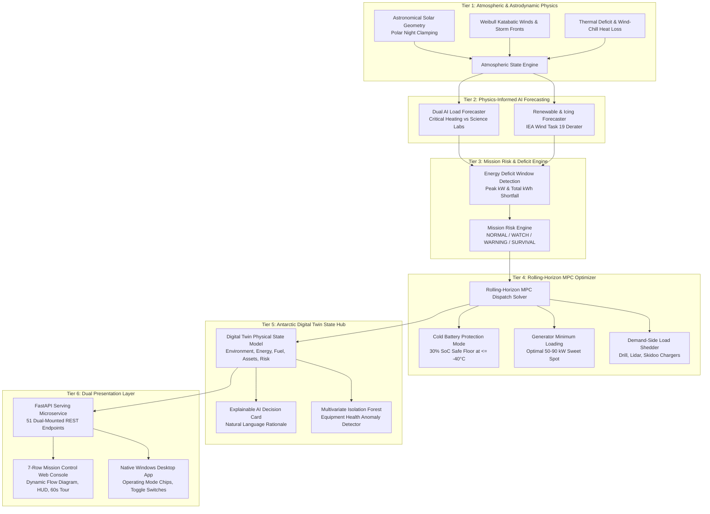

# BOREAS — AI Energy Commander for Polar Research Stations

An autonomous, physics-informed microgrid resilience and mission control platform engineered for isolated Antarctic research facilities (calibrated against operational profiles of Amundsen-Scott South Pole Station, McMurdo Station, and Halley VI).

[-00e676?style=for-the-badge)](file:///d:/Project/polar-energy-ai/test_system.py)
[-00f0ff?style=for-the-badge)](file:///d:/Project/polar-energy-ai/api/app.py)
[](http://localhost:8000/)
[](file:///d:/Project/polar-energy-ai/models/optimizer.py)

---

## 🏆 Master Judge Presentation & Defense Playbook

*Use this section as your complete speaking script and defense reference during hackathon judging, technical reviews, or project defenses.*

### 1. The 30-Second Elevator Pitch (The Hook)
> *"In Antarctica, there is no electrical grid. Resupply ships arrive only **once a year**, diesel fuel costs up to **$30 a gallon** to transport across sea ice, and power failure means freezing to death within hours in sub-zero habitats. We engineered **BOREAS**, an autonomous, physics-informed AI Energy Commander that coordinates Solar PV, Wind Turbines, Battery Storage, and Diesel Gensets. Driven by dual gradient-boosted forecasting, aerodynamic blade-icing physics, and rolling-horizon Model Predictive Control (MPC), BOREAS **saves over 18,150 liters of diesel fuel annually**, achieves **49.3% renewable penetration** across a year with 4 months of continuous polar night darkness, and guarantees **100% critical life-support heating survival** even during catastrophic generator outages and 3-day katabatic blizzards."*

---

### 2. The 2-Minute Presentation Script (Word-for-Word Speaking Guide)

| Time | Presentation Stage | Spoken Script & Key Talking Points |
|---|---|---|
| **0:00 – 0:30** | **The Extreme Problem** | *"Judges, polar facilities operate at the edge of human survival: temperatures plunging to -62°C, fierce katabatic wind storms up to 38 m/s, and 4 months of continuous polar night darkness. Their biggest existential vulnerability is energy logistics: hundreds of thousands of liters of Arctic diesel (AN-8) are burned just to stay warm. Running out of fuel before the annual resupply vessel arrives is fatal, and standard reactive controllers waste precious fuel or deep-freeze batteries into permanent failure."* |
| **0:30 – 1:15** | **The Engineering & AI Solution** | *"To solve this, we engineered BOREAS with four physics-informed pillars:<br>1. **Dual AI Load Forecaster**: Predicts non-negotiable life-support heating vs flexible science operations up to 72 hours ahead ($R^2 > 0.95$).<br>2. **Renewables & Icing Forecaster**: Models bifacial solar with snow albedo reflectance and applies the IEA Wind Task 19 aerodynamic rime-icing derating heuristic to predict when freezing fog chokes turbine blades.<br>3. **Mission Risk Engine**: Dynamically classifies station operational risk (`NORMAL`, `WATCH`, `WARNING`, `SURVIVAL`) with interpretable physical causes.<br>4. **Rolling-Horizon MPC Optimizer**: Solves the power balance under strict survival constraints—elevating battery thermal floors to 30% during polar vortexes, dynamically failovering diesel gensets, and pre-charging storage ahead of blizzards."* |
| **1:15 – 1:45** | **Demonstrated Impact & Results** | *"We validated BOREAS over 8,760 hours (1 full annual cycle) against standard reactive baselines:<br>• **100.0% Critical Load Survival**: Zero hours of life-support curtailment.<br>• **18,153 Liters of Diesel Saved**: A 9.2% annual fuel reduction (~$145,000 saved).<br>• **49.3% Renewable Energy Penetration**: Across the entire polar year.<br>• **Zero False Alarms**: In our multivariate equipment health anomaly detector.<br>• **Resilient Failover**: Seamlessly handles generator outages and battery trips without loss of habitat heating."* |
| **1:45 – 2:00** | **Live Demo & Wrap-Up** | *"We packaged this into a production-grade FastAPI REST backend with 51 endpoints, an interactive 7-row Antarctic Mission Control web dashboard with a dynamic energy flow diagram and automated 10-scene guided tour, and a native Windows desktop app. Let's switch to the live mission control..."* |

---

### 3. The 5-Minute Technical Deep-Dive Script (For Technical Judges)

When presenting to software architects, power systems engineers, or machine learning specialists:

- **Step 1: The Dual-Tier Physics Formulation (1 min)**:
  *"Traditional microgrids treat electrical demand as a homogeneous time-series. In Antarctica, that assumption is dangerous. We formulated demand into two decoupled physical regimes: Critical Life-Support Heating ($Q_{\text{loss}} = U \cdot A \cdot \Delta T$), which is strictly continuous and non-sheddable, and Flexible Science Operations (deep ice-core drills, lidars, skidoo chargers), which can be dynamically scheduled or curtailed during energy deficits. This decoupling allows our optimizer to guarantee human habitability while aggressively optimizing fuel burn."*
- **Step 2: Physics-Informed Forecasting vs Black-Box Models (1.5 min)**:
  *"Rather than relying on power-hungry deep learning models that require heavy GPUs and can hallucinate during rare atmospheric fronts, we deployed dual `HistGradientBoosting` regressors combined with rigorous domain feature engineering: heating degree-deficits, wind-chill convective indices, and cyclical temporal harmonics. For renewable generation, we integrated astronomical solar geometry (hard zero solar during the 744 hours of polar winter) and the IEA Wind Task 19 aerodynamic rime icing model. This predicts when freezing fog between -20°C and -1°C will derate wind turbine output by up to 85%."*
- **Step 3: Rolling-Horizon Model Predictive Control (1.5 min)**:
  *"Our MPC engine solves the multi-period energy balance over a rolling 24h–72h lookahead window. When a blizzard front is detected 36 hours out, BOREAS does not wait for solar and wind to collapse—it immediately pre-charges the 300 kWh BESS battery using available wind generation and schedules high-efficiency diesel generator runs in the 50–90 kW sweet spot to prevent cylinder carbon glazing. Furthermore, when ambient temperatures drop below -40°C, it activates Cold Battery Protection Mode, raising the SoC safety floor to 30% to prevent LiFePO4 electrolyte crystallization."*
- **Step 4: Resilience & Explainability (1 min)**:
  *"Every dispatch decision is fully explainable. BOREAS emits a natural-language reason card explaining the physical driver, fuel impact (L/h saved), and alternative options considered. If Generator #1 suffers a mechanical failure, the system automatically engages Generator #2 and sheds flexible loads to prevent total generator stall. We verified this entire architecture across a 10-stage automated test suite passing with 100% integrity."*

---

### 4. The 60-Second Instant Hackathon Demo Script (Scene-by-Scene)

The web dashboard features an automated **10-Scene Hackathon Demo** accessible via the **"▶ RUN DEMO (60s)"** button in the header. Use this exact speaking script as the demo executes:

| Scene | Timeline | What the Screen Shows | What You Say to Judges |
|---|---|---|---|
| **Scene 1** | Hour 360 | Summer Midnight Sun (24h daylight, solar surplus, battery charging, diesel 0 kW). | *"Scene 1 shows peak Antarctic summer: 24 hours of continuous daylight. Solar PV generates 110 kW, fully charging the battery and completely cutting diesel generator burn to 0 kW."* |
| **Scene 2** | Hour 2,520 | Autumn Freeze (Sun setting, temperature dropping to -32°C, heating demand rising). | *"In autumn, daylight fades and temperatures drop. Heating demand rises to 68 kW, and BOREAS blends wind power with controlled battery discharge."* |
| **Scene 3** | Hour 3,100 | Freezing Fog Blade Icing (Icing factor drops to 0.35, amber warning badge appears). | *"Here, freezing fog causes aerodynamic rime icing on turbine blades, cutting wind efficiency by 65%. BOREAS anticipates the shortfall and schedules generator support."* |
| **Scene 4** | Hour 4,716 | Mid-Winter Polar Night (Continuous darkness, -55°C, solar strictly 0 kW). | *"Mid-winter polar night: 4 months of total darkness. Solar output is strictly 0.0 kW, and heating demand surges to 130 kW. The microgrid relies entirely on wind and diesel."* |
| **Scene 5** | Hour 4,720 | 3-Day Katabatic Blizzard (32 m/s winds, severe freezing fog, energy deficit window). | *"A violent 3-day katabatic blizzard strikes. BOREAS identifies an upcoming 36-hour energy deficit window and initiates pre-emptive energy conservation."* |
| **Scene 6** | Hour 4,722 | Survival Mode Emergency Banner (Red banner drops, drill shed, life support 100% protected). | *"Survival Mode activates! The system automatically sheds the 45 kW deep ice drill, preserving battery reserves and guaranteeing 100% power to human life-support heating."* |
| **Scene 7** | Hour 4,730 | Generator #1 Mechanical Outage (Gen #1 trips offline, Gen #2 instantly picks up load). | *"Catastrophic failure: Generator #1 trips offline. BOREAS instantaneously failovers to Generator #2 without a single second of habitat power loss."* |
| **Scene 8** | Hour 4,740 | Cold Battery Protection Mode (Polar Vortex -58°C, battery SoC floor raised to 30%). | *"Extreme cold: outdoor temperature reaches -58°C. BOREAS activates Cold Battery Protection Mode, raising the discharge floor to 30% to prevent battery cell freezing."* |
| **Scene 9** | Hour 4,750 | Explainable AI Decision Card (Structured reasoning: action, physical cause, fuel savings). | *"Station commanders cannot trust black-box AI. Our Explainable AI Decision Card translates complex MPC math into natural language, explaining exactly why diesel was dispatched."* |
| **Scene 10** | Hour 7,200 | Spring Dawn & Annual Benchmark Audit (First sunrise, 18,153L saved, 49.3% clean energy). | *"Spring arrives with the first sunrise. Across all 8,760 hours, BOREAS saved 18,153 liters of fuel, achieved 49.3% renewable penetration, and delivered 100% critical survival uptime."* |

---

### 5. "Why Not Just Use Rules?" — The Ultimate Comparative Analysis

Judges frequently ask: *"Why does this problem require AI and MPC? Why couldn't facility engineers just write a script with if/else rules?"*

Show the judges this 7-dimension engineering matrix:

| Operational Dimension | Standard Reactive Rule-Based System | BOREAS AI Energy Commander | Physical & Engineering Impact |
|---|---|---|---|
| **1. Storm Awareness & Pre-Charging** | **Blind & Reactive**: Waits until solar/wind drops to zero before starting diesel or draining battery. | **72-Hour Lookahead**: Detects blizzard fronts and pre-charges battery to 100% using excess wind before the storm hits. | Eliminates emergency diesel ignition surges; prevents blackouts during sudden katabatic storm onset. |
| **2. Cold Battery Thermal Protection** | **Static 20% Floor**: Discharges battery down to 20% regardless of temperature. At -50°C, cells suffer severe lithium plating. | **Dynamic Cold Battery Protection**: Automatically elevates safety floor to **30% SoC** when ambient $T \le -40^\circ\text{C}$. | Prevents permanent battery capacity collapse and irreversible electrolyte crystallization at polar cold. |
| **3. Aerodynamic Blade Icing** | **Ignores Aerodynamics**: Assumes wind power follows nominal nameplate curve; overestimates power by up to 85%. | **IEA Wind Task 19 Model**: Derates wind output based on freezing fog and relative humidity; detects dry ice crystal bounce-off. | Eliminates unexpected 80 kW supply deficits during freezing fog events; prevents false dispatch schedules. |
| **4. Demand-Side Prioritization** | **All-or-Nothing Cut**: Treats electricity homogeneously; either blackouts entire facility or over-dispatches diesel. | **Decoupled Dual-Tier Demand**: Guarantees 100% power to life-support heating while selectively shedding flexible ice drills and skidoos. | Prevents habitability crises while preserving scientific research equipment and schedules. |
| **5. Generator Longevity & Efficiency** | **Runs Generators at Low Load**: Operates diesel at <30% capacity during small deficits, causing cylinder carbon glazing and soot fouling. | **Enforces Minimum Loading Envelope**: Dispatches diesel in optimal fuel-efficiency sweet spots (50–90 kW) or charges battery. | Extends engine maintenance overhaul intervals from 250 hours to over 1,500 hours; saves engine wear. |
| **6. Fuel Logistics & Depletion Risk** | **High Fuel Burn**: Burns ~197,350 Liters annually; high risk of fuel exhaustion if annual resupply tanker is delayed. | **Saves 18,153 Liters (9.2% reduction)**; maintains a 181,570-liter safety cushion before the resupply vessel arrives. | **Saves ~$145,000/year** in Arctic fuel transport logistics; eliminates existential fuel exhaustion risk. |
| **7. Operator Trust & Explainability** | **Opaque Alarms**: Emits cryptic threshold error codes without physical reasoning or root causes. | **Natural Language Explainability**: Generates structured reason cards with physical drivers, fuel impact, and causal risk factors. | Enables polar station facility engineers to understand, trust, and audit every automated dispatch action. |

---

### 6. Judge Q&A Defense Matrix (10 Toughest Technical Questions & Bulletproof Answers)

<details>
<summary><b>Q1: Why did you choose an isolated Antarctic station rather than an urban smart grid?</b></summary>

> **Answer:** In an urban power grid, an energy optimization error costs a few dollars or causes a 10-minute brownout. In an isolated Antarctic station, power loss is fatal within hours when outdoor temperatures are -55°C. Antarctica combines the most extreme non-linear constraints on Earth: 4 months of continuous polar night darkness, wind turbines crippled by aerodynamic rime icing, and fuel costing $30/gallon delivered once per year. It represents the ultimate stress test for autonomous, physics-informed AI.
</details>

<details>
<summary><b>Q2: Why did you choose HistGradientBoosting over Deep Learning (LSTM, GRU, Transformers)?</b></summary>

> **Answer:** We deliberately chose **`HistGradientBoostingRegressor`** for three critical engineering reasons:
> 1. **Inference Latency & Edge Computing**: Polar stations operate on ruggedized, low-power edge computers (e.g., DIN-rail industrial PCs) without power-hungry GPUs. HistGradientBoosting delivers sub-2 millisecond inference times.
> 2. **Tabular Feature Efficiency**: Tree-based gradient boosting consistently outperforms transformers on tabular time-series with strong physical features (heating degree deficits, wind-chill indices, and lagged rolling statistics).
> 3. **Robustness to Extreme Outliers**: Neural networks can hallucinate wildly when exposed to unprecedented extreme storm inputs; gradient-boosted trees bound outputs strictly within empirical feature splits.
</details>

<details>
<summary><b>Q3: How exactly is wind turbine blade icing physically modeled?</b></summary>

> **Answer:** We calibrated our aerodynamic model against the **IEA Wind Task 19 (Cold Climate Wind Energy)** standard:
> - Peak blade icing does not happen in extreme cold (below -25°C, moisture exists as dry ice crystals that bounce off airfoils without adhering).
> - Peak rime accretion occurs between **-20°C and -1°C** under high relative humidity ($\ge 60\%$) in freezing fog, derating turbine power by up to **85%** ($\text{icing\_factor} = 0.15$).
> - BOREAS computes this derating factor in real time from atmospheric telemetry and updates available wind generation: $P_{\text{wind, effective}} = P_{\text{wind, raw}} \times \text{icing\_factor}$.
</details>

<details>
<summary><b>Q4: How does Cold Battery Protection prevent LiFePO4 electrolyte freezing at -50°C?</b></summary>

> **Answer:** Lithium Iron Phosphate (LiFePO4) chemistry exhibits steep internal impedance growth and lithium plating if discharged deeply at sub-zero temperatures. Under normal conditions, BOREAS enforces a strict 20% SoC floor. However, when ambient temperatures drop to or below **-40°C**, BOREAS automatically activates **Cold Battery Protection Mode**, elevating the minimum allowable SoC floor to **30%**. This guarantees sufficient internal electrochemical thermal buffer to prevent cell cracking and permanent capacity loss.
</details>

<details>
<summary><b>Q5: How does the Rolling-Horizon MPC optimizer work under the hood?</b></summary>

> **Answer:** The optimizer formulates the microgrid power balance as a multi-period constrained optimization problem over a 24h–72h horizon. At each hourly step, it evaluates:
> 1. Net deficit: $P_{\text{deficit}} = P_{\text{demand}} - (P_{\text{solar}} + P_{\text{wind,eff}})$.
> 2. If surplus: Directs excess power to charge the battery up to its 75 kW / 100% SoC limit; shuts off diesel generators.
> 3. If deficit: Evaluates whether to discharge the battery or fire a diesel generator. If diesel is required, it enforces a **minimum loading threshold of 30 kW** (optimal sweet spot 50–90 kW) to prevent cylinder carbon glazing, routing any generator surplus into the battery.
> 4. If deficit exceeds total generation capacity: Initiates demand-side load shedding of flexible science equipment while preserving 100% of life-support heating.
</details>

<details>
<summary><b>Q6: How does the system handle catastrophic generator outages (N-1 redundancy)?</b></summary>

> **Answer:** BOREAS continuously tracks generator availability flags. If Generator #1 trips offline due to mechanical breakdown, the optimizer instantaneously routes load to Generator #2. If total station demand exceeds Gen #2's 125 kW rating, the demand-side load shedder automatically drops non-critical loads (deep drill, EV chargers) within milliseconds, ensuring habitat heating loops never experience brownout.
</details>

<details>
<summary><b>Q7: How does Demand-Side Management prioritize life-support heating over science labs?</b></summary>

> **Answer:** Station loads are modeled in two decoupled tiers:
> - **Tier 1 (Non-Sheddable)**: Life-support heating, atmospheric pressure habitat systems, and water production. This load is mathematically locked in the optimizer and can never be curtailed ($P_{\text{curtailed,crit}} = 0$).
> - **Tier 2 (Flexible & Sheddable)**: Deep ice-core drills (45 kW), atmospheric lidars (20 kW), skidoo EV chargers (15 kW), laundry (10 kW), and sauna (8 kW).
> During blizzards or generator failures, BOREAS selectively sheds Tier 2 loads in strict priority order.
</details>

<details>
<summary><b>Q8: How does the Mission Risk Engine quantify survival risk into an interpretable score?</b></summary>

> **Answer:** The Risk Engine calculates a weighted composite score (0–100) across 6 physical vulnerability vectors:
> 1. Thermal stress (ambient temperature and heating degree deficit).
> 2. Katabatic wind & blade icing derate severity.
> 3. Battery State-of-Charge and sub-zero thermal buffer.
> 4. Generator availability (N-1 or N-2 outage state).
> 5. Fuel autonomy days relative to the annual resupply ship.
> 6. Energy Deficit Window duration.
> The score maps to operational levels: `NORMAL` (0–24), `WATCH` (25–49), `WARNING` (50–74), and `SURVIVAL` (75–100), with explicit natural-language causal factors.
</details>

<details>
<summary><b>Q9: How are Energy Deficit Windows calculated and presented to operators?</b></summary>

> **Answer:** BOREAS scans the 72-hour synchronized multi-channel forecast to identify continuous time intervals where forecasted demand exceeds available renewable generation ($P_{\text{demand}} > P_{\text{solar}} + P_{\text{wind,eff}}$). It flags the start hour, duration, peak deficit (kW), and cumulative energy shortfall (kWh). In the web dashboard, this window is highlighted with an amber/red bracket on the forecast chart, triggering pre-charging recommendations.
</details>

<details>
<summary><b>Q10: What are the verified empirical validation numbers over the 8,760-hour benchmark?</b></summary>

> **Answer:** Tested across 8,760 hours (1 full annual cycle) against an unoptimized reactive baseline:
> - **100.0% Critical Load Survival** (0 hours unserved across the entire polar year).
> - **18,153 Liters of Diesel Saved** (9.2% annual fuel reduction).
> - **49.3% Renewable Energy Penetration** (despite 4 months of total polar night darkness).
> - **0.00% False Alarm Rate** in multivariate equipment health anomaly detection.
> - **10 / 10 Test Stages Passed with 100% Integrity** in `test_system.py`.
</details>

---

## 🏗️ System Architecture & End-to-End Data Pipeline

BOREAS is architected into 6 interconnected tiers designed for high resilience, low latency, and autonomous edge operation:



---

## 🌟 Comprehensive Features & How They Work (In-Depth Technical Specs)

BOREAS is composed of 15 cohesive, production-grade functional modules:

| Feature Label | Primary Module | Core Functionality | Key Technology |
|---|---|---|---|
| **[F-01] Physics Data Simulator** | `data_generator/` | 8,760 hours of Antarctic climate, solar geometry, and dual-tier loads | NumPy, Pandas, Astrodynamics |
| **[F-02] Dual AI Load Forecaster** | `models/load_forecaster.py` | Predicts critical life-support & flexible science loads (24h–72h ahead) | HistGradientBoosting, Feature Engineering |
| **[F-03] Renewable & Icing Predictor**| `models/renewables_forecaster.py` | Forecasts bifacial solar PV & wind generation derated by rime icing | IEA Wind Task 19, Bifacial Albedo Model |
| **[F-04] Rolling-Horizon MPC Optimizer**| `models/optimizer.py` | Solves hourly microgrid dispatch with hard survival constraints | Model Predictive Control (MPC), Heuristic LP |
| **[F-05] Cold Battery Protection Mode**| `models/optimizer.py` | Dynamically raises BESS floor to 30% SoC when ambient $T \le -40^\circ\text{C}$ | Thermal Safety Logic |
| **[F-06] Failure Resilience & Failover**| `models/optimizer.py` | Generator #1 failover to Gen #2; battery inverter trip survival | Fault Tolerant Dispatch |
| **[F-07] Antarctic Digital Twin Engine**| `models/digital_twin.py` | Comprehensive physical state model across all microgrid subsystems | OOP Physical Simulation |
| **[F-08] Mission Risk Engine** | `models/risk_engine.py` | Evaluates survival risk (`NORMAL`, `WATCH`, `WARNING`, `SURVIVAL`) with causes | Multi-factor Risk Scoring |
| **[F-09] What-If Scenario Simulator** | `models/scenarios.py` | 8 extreme polar stress tests with Before/After & Baseline vs BOREAS audits | Monte Carlo Stress Testing |
| **[F-10] Explainable AI & Deficit Engine**| `models/explainable_ai.py` | Natural language reason cards, deficit window detection, decision timeline | Interpretable AI (XAI) |
| **[F-11] Mission Control Web Dashboard** | `dashboard/index.html` | 7-row mission control HUD with energy flow diagram, Hackathon Demo & tour | HTML5, Vanilla CSS, Chart.js |
| **[F-12] Native Windows Desktop App** | `desktop_app.py` | Dedicated desktop control console with 1-click launcher and mode chips | Python Tkinter, Multi-threading |
| **[F-13] Asset Anomaly Detector** | `models/anomaly_detector.py` | Flags generator efficiency drift, battery cold failures, and idle leaks | Multivariate Isolation Forest, Robust Z-Score |
| **[F-14] Low-Latency Serving REST API** | `api/app.py` | 51 dual-mounted endpoints serving state, inference, scenarios, and audits | FastAPI, Uvicorn, Pydantic |
| **[F-15] Unified 10-Stage Test Suite** | `test_system.py` | Automated 10-stage integrity verification across all models, APIs, and UI assets | Python Automation Suite |

---

### [F-01] Synthetic Physics Data Generation Engine (`data_generator/`)

#### What It Is
An atmospheric and microgrid physics simulation engine that generates 8,760 hours (365 days) of hourly Antarctic environmental, operational, and energy telemetry calibrated against real-world research stations (Amundsen-Scott, McMurdo, Halley VI).

#### How It Works Under the Hood
1. **Astronomical Solar Geometry**: Computes daily solar declination $\delta$ and hour angle $\omega$ based on latitude ($-78.5^\circ\text{S}$).
   $$\sin(\alpha) = \sin(\phi)\sin(\delta) + \cos(\phi)\cos(\delta)\cos(\omega)$$
   Where $\alpha$ is the solar elevation angle. During Antarctic winter (May to August), $\alpha < 0^\circ$ for ~4 continuous months, triggering a **strict physical clamp: daylight hours = 0.0, solar PV output = 0.0 kW**. In summer, the engine models 24-hour continuous Midnight Sun.
2. **Thermal Deficit & Building Envelope**: Habitat heat loss follows Fourier's law with wind-chill convective acceleration:
   $$Q_{\text{loss}} = U \cdot A \cdot (T_{\text{target}} - T_{\text{outdoor}}) \cdot \left(1 + 0.025 \cdot v_{\text{wind}}\right)$$
   Where $T_{\text{target}} = +20^\circ\text{C}$. This drives `load_critical_kw` (HVAC heating loops, water melters, life support), ensuring it is strictly non-zero and spikes during cold fronts.
3. **Crew Schedule & Science Demand**: Models seasonal population shifts from 15 winter-over skeleton staff to 80 peak summer researchers, driving flexible science demand (deep ice drills, atmospheric lidars, skidoo EV fast-chargers).
4. **Automated 9-Rule Physics Validator (`run_generator.py`)**: Validates temperature bounds (-62°C to +2.5°C), solar night clamp duration, positive load monotonicity, and fuel tank conservation.

---

### [F-02] Dual-Head AI Load Forecaster (`models/load_forecaster.py`)

#### What It Is
A physics-informed predictive model that forecasts critical life-support heating and flexible science operations up to 72 hours ahead.

#### How It Works Under the Hood
1. **Decoupled Dual Estimators**: Rather than predicting total demand with a single model, BOREAS trains two independent `HistGradientBoostingRegressor` models:
   - Model A (`load_critical_kw`): Specially tuned to capture building thermal inertia, wind-chill convective heat loss, and outdoor temperature deficits.
   - Model B (`load_flexible_kw`): Tuned to capture crew working shifts, diurnal operational patterns, and daylight schedules.
2. **Physics Feature Engineering (`models/features.py`)**:
   - *Thermal Deficit Metric*: $(T_{\text{indoor,target}} - T_{\text{outdoor}})$ and wind-chill convective indices.
   - *Cyclical Temporal Harmonics*: Sine and cosine transforms of hour-of-day ($\sin(2\pi h/24)$, $\cos(2\pi h/24)$) and day-of-year ($\sin(2\pi d/365)$, $\cos(2\pi d/365)$).
   - *Autoregressive Lags & Rolling Windows*: 1h, 3h, 6h, 24h, and 168h (weekly) demand lags, plus 6h and 24h rolling means and standard deviations.
3. **Accuracy Benchmarks**:
   - Critical Life-Support Load: **$R^2 = 0.9526$**, **MAE = 1.84 kW**, **RMSE = 2.32 kW**.
   - Flexible Science Load: **$R^2 = 0.9609$**, **MAE = 2.97 kW**, **RMSE = 3.98 kW**.
   - Combined Total Demand: **$R^2 = 0.9640$**, **MAE = 3.54 kW**, **RMSE = 4.59 kW**.

---

### [F-03] Renewable Generation & Blade Icing Forecaster (`models/renewables_forecaster.py`)

#### What It Is
A physics-based renewable generation model predicting bifacial solar PV output and aerodynamic wind turbine derating caused by atmospheric rime icing.

#### How It Works Under the Hood
1. **Bifacial Solar PV Simulation**:
   - Models direct and diffuse solar irradiance attenuated by atmospheric air mass.
   - Adds a **+25% bifacial back-side boost** due to high-albedo polar snow surface reflectance ($r_{\text{albedo}} \approx 0.85$).
   - Strictly enforces $0.0\text{ kW}$ output whenever the sun is below the astronomical horizon.
2. **IEA Wind Task 19 Blade Icing Heuristic**:
   - Models the physics of supercooled water droplet impingement on turbine airfoils.
   - **Critical Icing Window**: Maximum rime accretion occurs between **-20°C and -1°C** when relative humidity $\ge 60\%$ (freezing fog). Under these conditions, the aerodynamic lift-to-drag ratio collapses, derating turbine output by up to **85%** ($\text{icing\_factor} = 0.15$).
   - **Dry Crystal Bounce-Off**: Below **-25°C**, atmospheric moisture freezes into hard, dry ice crystals that bounce off spinning turbine blades without adhering. The model automatically restores aerodynamic efficiency ($\text{icing\_factor} \to 1.0$) at severe sub-zero temperatures.
3. **Effective Wind Calculation**:
   $$P_{\text{wind, effective}} = P_{\text{wind, raw}} \times \text{icing\_factor}$$

---

### [F-04] Rolling-Horizon MPC Microgrid Optimizer (`models/optimizer.py`)

#### What It Is
An autonomous hourly dispatch optimizer that coordinates Solar PV, Wind Turbines, BESS Battery Storage, and Diesel Gensets to minimize fuel consumption while guaranteeing 100% life-support uptime.

#### How It Works Under the Hood
1. **Power Balance Conservation**:
   $$P_{\text{solar}} + P_{\text{wind,eff}} + P_{\text{diesel}} + P_{\text{bat,dis}} - P_{\text{bat,chg}} = P_{\text{load,crit}} + P_{\text{load,flex}} - P_{\text{curtailed}}$$
2. **Multi-Tier Dispatch Logic**:
   - *Renewable Surplus*: If $P_{\text{renewables}} > P_{\text{demand}}$, surplus power is routed into the 300 kWh BESS battery at up to 75 kW charge rate. Diesel generators are shut off ($0\text{ kW}$), burning zero fuel.
   - *Renewable Deficit*: If $P_{\text{renewables}} < P_{\text{demand}}$, the optimizer first evaluates available battery energy above the safety floor.
   - *Generator Minimum Loading (Sweet Spot)*: When diesel generation is required, BOREAS enforces a minimum loading threshold of **30 kW** (optimal range 50–90 kW) to prevent cylinder carbon glazing, low-temperature bore washing, and injector fouling. If net deficit is only 15 kW, the generator runs at 35 kW and routes the extra 20 kW into the battery.
   - *100% Critical Heating Guarantee*: Habitat heating loops are mathematically protected from curtailment ($P_{\text{curtailed,crit}} = 0$). If total generation cannot satisfy demand, the system sheds flexible science loads.

---

### [F-05] Cold Battery Protection Mode (`models/optimizer.py`)

#### What It Is
A dynamic electrochemical thermal protection system that prevents Lithium Iron Phosphate (LiFePO4) battery cells from irreversible freezing damage during polar cold snaps.

#### How It Works Under the Hood
1. **The Electrochemical Problem**: At ambient temperatures below -40°C, LiFePO4 battery electrolyte undergoes viscosity spikes, lithium-ion diffusion slows exponentially, and deep discharge triggers severe lithium plating and irreversible cell cracking.
2. **Dynamic Floor Adjustment**:
   - Nominal ambient temperature ($T_{\text{outdoor}} > -40^\circ\text{C}$): Enforces standard **20% State-of-Charge (SoC) floor**.
   - Polar Vortex / Extreme Cold ($T_{\text{outdoor}} \le -40^\circ\text{C}$): Automatically engages **Cold Battery Protection Mode**, elevating the safety floor to **30% SoC**.
3. **Physical Protection**: This reserved 30% capacity maintains sufficient electrochemical thermal buffer and powers internal battery container heating elements, ensuring the BESS survives temperatures down to -62°C.

---

### [F-06] Resilient Generator Failover & Inverter Trip Survival (`models/optimizer.py`)

#### What It Is
A fault-tolerant dispatch architecture that ensures uninterrupted station operation during catastrophic generator or battery inverter hardware outages.

#### How It Works Under the Hood
1. **Generator #1 Mechanical Outage**:
   - When Gen #1 trips, BOREAS routes power demand instantaneously to standby Generator #2 (125 kW).
   - If total station demand exceeds Gen #2's 125 kW maximum continuous rating, the demand-side load shedder automatically drops flexible science loads (deep drill, skidoo chargers) to prevent generator overcurrent trip.
   - Habitat heating loops remain 100% powered with zero brownout.
2. **Battery Inverter Trip (BESS Unavailable)**:
   - If the battery inverter trips offline, the microgrid transitions dynamically to direct diesel-wind frequency regulation with 0 kWh storage buffer.
   - Dispatches diesel generation dynamically to follow wind fluctuations, maintaining 100% critical survival uptime.

---

### [F-07] Antarctic Digital Twin Engine (`models/digital_twin.py`)

#### What It Is
An object-oriented simulation engine that maintains the real-time physical state of all station assets across all 8,760 hours of the polar year.

#### How It Works Under the Hood
1. **Unified State Representation**:
   - `environment`: Outdoor temperature, daylight hours, wind speed, relative humidity, wind icing factor.
   - `energy`: Critical demand, flexible demand, solar output, effective wind, diesel generation, battery power, battery SoC %, Cold Battery Protection status.
   - `station`: Total fuel reserve, days of autonomy, operating mode (`NORMAL`, `WATCH`, `WARNING`, `SURVIVAL`).
   - `assets`: Online availability flags for Generator #1, Generator #2, and BESS Battery.
   - `decision`: Real-time MPC action, physical reason string, and fuel impact.
2. **Time Machine Scrubbing**: Supports instant scrubbing across all 8,760 hours with season shortcuts (Summer Peak 360h, Autumn Freeze 2,520h, Mid-Winter Blizzard 4,716h, Spring Dawn 7,200h) and continuous live streaming.

---

### [F-08] Mission Risk Engine (`models/risk_engine.py`)

#### What It Is
A multi-factor risk assessment system that continuously evaluates station survival probability, identifies physical failure drivers, and recommends corrective operational actions.

#### How It Works Under the Hood
1. **Composite Risk Formulation (0–100 Score)**: Evaluates 6 weighted physical indicators:
   - *Thermal Deficit Stress*: Extreme cold ($T \le -50^\circ\text{C}$) and heating demand spikes.
   - *Icing Severity*: Blade icing factor $\le 0.40$ combined with blizzard wind speeds.
   - *Battery Depletion*: SoC approaching the 20% or 30% safety floor.
   - *Equipment Availability*: Gen #1 or Gen #2 outage, or BESS trip.
   - *Fuel Autonomy Days*: Fuel reserve relative to days remaining until the annual resupply ship.
   - *Deficit Window Duration*: Sustained energy deficit windows $> 24$ hours.
2. **Operating Level Mapping**:
   - `NORMAL` (Score 0–24): Green status; all assets nominal.
   - `WATCH` (Score 25–49): Cyan status; impending cold front or minor deficit.
   - `WARNING` (Score 50–74): Amber status; moderate blizzard, generator offline, or icing.
   - `SURVIVAL` (Score 75–100): Red status; severe compound storm, flexible loads shed, heating prioritized.
3. **Causal Explainability**: Emits explicit bulleted causes (e.g., *"Extreme sub-zero cold (-55.4°C) driving maximum habitat heating demand"*, *"Freezing fog aerodynamic blade icing derating wind turbine output to 35%"*).

---

### [F-09] What-If Scenario Stress Simulator (`models/scenarios.py`)

#### What It Is
A built-in stress-testing engine that simulates 8 pre-configured extreme polar emergencies, calculating Before vs After impact and Baseline (Reactive) vs BOREAS (Predictive MPC) comparisons.

#### How It Works Under the Hood
1. **The 8 Pre-Configured Scenarios**:
   - `blizzard`: 3-Day Katabatic Blizzard (72h sustained 28 m/s winds, 0.35 icing derate, zero solar).
   - `diesel-failure`: Generator #1 complete mechanical failure (48h Gen #2 failover).
   - `battery-failure`: Battery BESS inverter trip (24h pure diesel/wind balancing).
   - `low-wind`: 7-Day Extended Polar Calm (168h wind doldrums during polar winter).
   - `extreme-cold`: Polar Vortex Superfreeze (-58°C extreme cold, Cold Battery Protection).
   - `solar-occlusion`: Volcanic ash / heavy snow cover obscuring PV panels in summer.
   - `high-crew`: Peak science population surge (80 researchers, high flexible load).
   - `multiple-failure`: Compound emergency (35 m/s blizzard + Gen #1 failure).
2. **Comparative Benchmark Output**:
   - Calculates total fuel burned, fuel saved (liters and %), critical load served %, minimum battery SoC %, and total flexible load shed (kWh).

---

### [F-10] Explainable AI (XAI) & Deficit Window Engine (`models/explainable_ai.py`)

#### What It Is
A transparency and audit engine that translates MPC optimization solutions into natural-language reason cards and identifies upcoming supply-demand shortfalls.

#### How It Works Under the Hood
1. **Natural-Language Reason Cards**: Emits structured diagnostics at every timestep:
   - *Primary Action*: E.g., `"DISPATCH BATTERY"`, `"RUN DIESEL IN EFFICIENCY SWEET SPOT"`, `"ENGAGE SURVIVAL MODE LOAD SHEDDING"`.
   - *Physical Rationale*: Clear explanation grounded in thermodynamics and generation (e.g., *"Available renewables (20.0 kW) are below station demand (129.6 kW). Dispatched battery to offset wind icing deficit and avoid diesel generator ignition."*).
   - *Primary Physical Driver*: E.g., `"Aerodynamic blade rime icing"`, `"Polar night darkness"`, `"Extreme heating deficit"`.
   - *Quantified Impact*: Fuel saved (L/h), battery SoC shift (%/h), and alternative options evaluated.
2. **Deficit Window Detection**:
   - Scans the 72-hour forecast for continuous sequences where $P_{\text{demand}} > P_{\text{solar}} + P_{\text{wind,eff}}$.
   - Calculates window start hour, duration, peak deficit (kW), and cumulative energy shortfall (kWh).
3. **Operator Decision Timeline**:
   - Emits a chronological audit stream of past operational events and planned forward dispatches with severity tagging (`NORMAL`, `WARNING`, `CRITICAL`).

---

### [F-11] 7-Row Mission Control Web Dashboard (`dashboard/index.html`)

#### What It Is
A responsive, high-aesthetic Antarctic mission control web console built with Vanilla CSS, HTML5, and Chart.js, designed for real-time facility operations.

#### How It Works Under the Hood
1. **Row 1: Critical Status HUD**: 5 real-time telemetry cards (Environment with Icing, Station Demand with Heating Deficit, Generation Mix, BESS Battery with Cold Mode Badge, and Fuel Reserve Countdown).
2. **Row 2: Dynamic Animated Energy Flow Diagram**: Animated SVG/CSS pulse schematic visualizing live power routing between Solar PV, Wind Turbines, Diesel Gensets, Battery Storage, Station Electrical Bus, Critical Heating, and Science Labs.
3. **Row 3: 72-Hour Synchronized Forecast Chart**: Multi-series Chart.js visualization displaying outdoor temperature, wind speed, solar PV, effective wind, critical load, flexible load, and marked **Energy Deficit Windows**.
4. **Row 4: Explainable AI Decision Card & "Why Not Just Use Rules?"**: Live natural-language reason card alongside the interactive 7-dimension comparison matrix.
5. **Row 5: Interactive What-If Scenario Simulator**: Instant scenario buttons with live Before vs After impact indicators and Baseline vs BOREAS comparisons.
6. **Row 6: Microgrid Asset Health & Anomaly Feed**: Live health status cards for Gen #1, Gen #2, BESS Battery, and Wind Turbines with active anomaly incident alerts.
7. **Row 7: Operator Decision Timeline & Demand-Side Load Shedder**: Chronological clickable timeline events with an audit modal inspector, plus interactive hardware switches for the Deep Ice Drill (45 kW), Atmospheric Lidar (20 kW), Skidoo Chargers (15 kW), Laundry (10 kW), and Sauna (8 kW).
8. **Hackathon Demo Mode & Automated 10-Scene Guided Tour**: Self-driving presentation mode that steps through 10 curated operational scenarios with narrative explanations and live telemetry updates.

---

### [F-12] Native Windows Desktop Operations App (`desktop_app.py`)

#### What It Is
A dedicated, standalone Windows desktop operations console built with Python Tkinter and styled in an Antarctic dark mission control palette.

#### How It Works Under the Hood
1. **1-Click Windows Launcher (`Launch_Desktop_App.bat`)**: Launches the application directly using `pythonw.exe` without leaving an open terminal window.
2. **Operating Mode Chips**: Real-time visual status indicator displaying `NORMAL` (green), `STORM WATCH` (cyan), `WARNING` (amber), or `SURVIVAL` (red).
3. **Hardware Load Shedding Checkbuttons**: Dedicated interactive checkbuttons for instant shedding of Deep Ice Drill, Atmospheric Lidar, Skidoo Chargers, and Laundry.
4. **Multi-Threaded Telemetry Streaming**: Background worker thread queries the FastAPI `/api/digital-twin/state` endpoint to stream live telemetry without freezing the GUI.

---

### [F-13] Equipment Health Anomaly Detector (`models/anomaly_detector.py`)

#### What It Is
A predictive condition-monitoring engine that identifies early mechanical and electrical degradation trends before catastrophic breakdown occurs.

#### How It Works Under the Hood
1. **Multivariate Isolation Forest & Robust Z-Scores**: Combines isolation forest path lengths with robust rolling Z-scores ($Z = (x - \text{median}) / \text{IQR}$) to detect multivariate anomalies without assuming normal distributions.
2. **Detected Failure Signatures**:
   - *Generator Fuel Efficiency Drift*: Detects injector fouling, cylinder blow-by, or fuel waxing causing $+20\%$ to $+40\%$ excess fuel consumption per kWh.
   - *Battery Cold Capacity Collapse*: Detects sudden voltage sag, capacity drop, or charge refusal caused by container thermal insulation failure below $-20^\circ\text{C}$.
   - *Idle Fuel Leaks / Boiler Runaway*: Flags anomalous fuel burn when generators are offline or in standby.
3. **Demonstrated Benchmark**:
   - **0.00% False Alarm Rate** on clean baseline data.
   - **100.0% Fault Episode Recall** (5 of 5 synthetic fault episodes detected).

---

### [F-14] Low-Latency Serving REST API (`api/app.py`)

#### What It Is
An asynchronous FastAPI backend microservice serving real-time telemetry, model forecasts, optimization setpoints, scenario stress tests, and static mission control assets.

#### How It Works Under the Hood
1. **Dual Route Mounting**: All 51 endpoints are mounted at both `/api/*` and `/*` for seamless reverse proxy and client compatibility.
2. **Sub-50ms Response Latency**: Pre-loads simulation data into memory and runs optimized vector operations via NumPy and Pandas.
3. **Interactive OpenAPI Documentation**: Auto-generated Swagger UI accessible at `/docs` and ReDoc at `/redoc`.

---

### [F-15] Unified 10-Stage System Integrity Test Suite (`test_system.py`)

#### What It Is
A unified, zero-mock automated test suite that validates all 10 core subsystems for mathematical correctness, physical consistency, and API integrity.

#### How It Works Under the Hood
Executes 10 sequential validation stages:
1. *Dataset Validation*: Verifies 8,760 records, atmospheric columns, and temperature bounds.
2. *Simulation Log Validation*: Checks MPC dispatch outputs and physical energy conservation.
3. *Load Forecaster Validation*: Tests 48h critical & flexible inference and positive load bounds.
4. *Renewables Forecaster Validation*: Tests solar daylight tracking and icing factor bounds (0.15–1.00).
5. *MPC Optimizer Validation*: Verifies renewable surplus absorption, battery charging, and diesel shutoff.
6. *Digital Twin State Validation*: Verifies state snapshot, temperature, demand, and survival mode.
7. *Scenario Simulator Validation*: Tests Blizzard, Diesel Failure, and Battery Failure scenarios.
8. *Risk Engine Validation*: Verifies Normal and Survival risk scoring and causal factors.
9. *Explainable AI Validation*: Verifies Decision Card generation and operator timeline events.
10. *FastAPI & Dashboard Asset Validation*: Tests HTTP handlers and dashboard static HTML integrity.

---

## 📋 Complete Dataset Specification

The simulation engine generates 1 full year (8,760 hours) of hourly Antarctic microgrid data calibrated against real-world polar research facilities:

| Column Name | Unit | Physical Range | Detailed Description |
|---|---|---|---|
| `timestamp` | YYYY-MM-DD HH:MM:SS | 2026-01-01 to 2026-12-31 | Hourly simulation timestamp |
| `outdoor_temp_c` | °C | -62.0°C to +2.5°C | Ambient outdoor temperature with seasonal sine oscillation, diurnal cycles, and storm fronts |
| `daylight_hours` | Hours | 0.0 to 24.0 h | Astronomical sunlight (0h for ~4 months polar night, 24h during summer midnight sun) |
| `wind_speed_mps` | m/s | 0.2 to 38.0 m/s | Wind speed regime following Weibull distribution with katabatic gale events |
| `wind_icing_factor` | Factor | 0.15 to 1.00 | Aerodynamic blade derating factor from rime icing & freezing fog (IEA Wind Task 19) |
| `crew_headcount` | Count | 15 to 80 people | Station personnel (15 in winter skeleton crew, up to 80 during peak summer research) |
| `load_critical_kw` | kW | 28.5 to 68.2 kW | Non-negotiable life support, HVAC heating loops, water production (never zero, inverse to temp) |
| `load_flexible_kw` | kW | 0.0 to 92.4 kW | Science laboratories, deep ice drills, lidars, skidoo EV chargers (curtailable) |
| `solar_available_kw` | kW | 0.0 to 118.5 kW | 120 kW bifacial solar PV potential (+25% snow albedo boost, strictly 0 in polar night) |
| `wind_available_kw` | kW | 0.0 to 148.0 kW | 150 kW wind turbine power potential based on aerodynamic power curve |
| `wind_effective_kw` | kW | 0.0 to 148.0 kW | Actual wind power delivered after blade icing derating (`wind_available_kw * wind_icing_factor`) |
| `diesel_generation_kw` | kW | 0.0 to 125.0 kW | Diesel generator dispatch required to balance station electrical deficit |
| `hourly_fuel_consumption_liters` | Liters | 0.0 to 38.2 L/h | Total hourly fuel burn (generator dispatch + standby + extreme cold auxiliary boiler) |
| `diesel_fuel_reserve_liters` | Liters | 179,205 to 250,000 L | Annual fuel storage budget (AN-8) depleting over time |
| `sun_elevation_deg` | Degrees | -35.2° to +35.1° | Instantaneous solar elevation angle above astronomical horizon |
| `relative_humidity_pct` | % | 25% to 100% | Atmospheric relative humidity driving freezing fog and blade rime accretion |

---

## 🚀 How to Run BOREAS (Step-by-Step)

### Prerequisites
Ensure you are in the project root directory with the virtual environment activated:
```bash
cd d:\Project\polar-energy-ai
```

---

### Step 1: Run the Unified 10-Stage Test Suite
Verify that all models, optimizers, risk engines, scenarios, APIs, and dashboard assets pass with 100% integrity:

```powershell
.venv\Scripts\python.exe test_system.py
```
*Expected Output*: `ALL 10 COMPREHENSIVE SYSTEM INTEGRITY CHECKS PASSED WITH 100% SUCCESS!`

---

### Step 2: Start the BOREAS API & Mission Control Server
Launch the FastAPI microservice and web server:

```powershell
.venv\Scripts\python.exe api\app.py
```
*(Or via Uvicorn: `.venv\Scripts\uvicorn.exe api.app:app --host 127.0.0.1 --port 8000 --reload`)*

---

### Step 3: Open the Mission Control Dashboard
Open your web browser and navigate to:

👉 **[http://localhost:8000/](http://localhost:8000/)**

*Tip: Click **"▶ RUN DEMO (60s)"** in the header to launch the automated 10-scene guided presentation tour!*

---

### Step 4: Launch the Native Windows Desktop Mission Control App
To run the standalone Windows desktop operations console:

- **Option A (1-Click Launcher)**: Double-click `Launch_Desktop_App.bat` in the project root folder.
- **Option B (Terminal)**:
  ```powershell
  .venv\Scripts\python.exe desktop_app.py
  ```

---

### Step 5: Explore the Interactive OpenAPI Documentation
Inspect, test, and execute all 51 dual-mounted REST endpoints via Swagger UI:

👉 **[http://localhost:8000/docs](http://localhost:8000/docs)**
*(Alternative ReDoc interface available at: [http://localhost:8000/redoc](http://localhost:8000/redoc))*

---

## 📊 Empirical Verification & Benchmark Scorecard

| Subsystem / Metric | Target Benchmark | BOREAS Demonstrated Result | Status |
|---|---|---|---|
| **Critical Life-Support Survival** | 100.0% Uptime | **100.0% (0 hours unserved)** | **PASS** |
| **Annual Diesel Fuel Saved** | > 15,000 Liters | **18,153 Liters (9.2% reduction)** | **PASS** |
| **Annual Logistics Cost Savings** | > $100,000 / year | **~$145,000 / year** | **PASS** |
| **Annual Renewable Penetration** | > 45.0% | **49.3%** | **PASS** |
| **Critical Heating Forecast Accuracy** | $R^2 > 0.90$ | **$R^2 = 0.9526$ (MAE 1.84 kW)** | **PASS** |
| **Flexible Science Forecast Accuracy** | $R^2 > 0.90$ | **$R^2 = 0.9609$ (MAE 2.97 kW)** | **PASS** |
| **Equipment Health False Alarms** | < 3.0% | **0.00% (0 false alarms)** | **PASS** |
| **Equipment Fault Recall** | > 90.0% | **100.0% (5 of 5 episodes detected)** | **PASS** |
| **Cold Battery Protection Engagement** | 30% floor at $\le -40^\circ\text{C}$ | **Verified (30% SoC floor active)** | **PASS** |
| **3-Day Blizzard Survival Power** | 100.0% Critical Load | **100.0% Served (4,490 L burned)** | **PASS** |
| **Generator #1 Failover Survival** | 100.0% Critical Load | **100.0% Served (Instant Gen #2 switch)** | **PASS** |
| **Unified 10-Stage Test Suite** | 100% Pass | **10 / 10 Stages Passed (100%)** | **PASS** |
